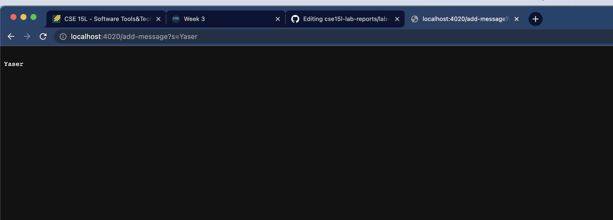
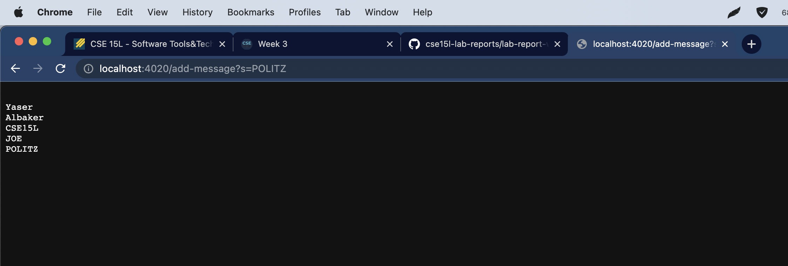
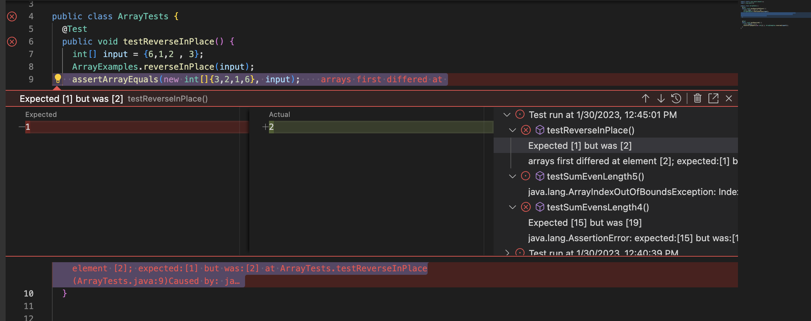
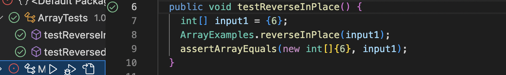

PART 1:


Code for String Server:

```import java.io.IOException;
import java.net.URI;
import java.util.ArrayList;
public class StringHandler implements URLHandler {
    private ArrayList<String> messages = new ArrayList<String>();
    
    public String handleRequest(URI uri) {
        if (uri.getPath().contains("/add-message")) {
            System.out.println(uri.getPath());
            String[] message = uri.getQuery().split("=");
            messages.add(message[1]);
            StringBuilder result = new StringBuilder();
            for (String s : messages) {
                result.append("\n" +s);
            }
            return result.toString();
        }else{
            return "Invalid request";
        }
    }
}


class StringServer {
    public static void main(String[] args) throws IOException {
        if(args.length == 0){
            System.out.println("Missing port number! Try any number between 1024 to 49151");
            return;
        }

        int port = Integer.parseInt(args[0]);

        Server.start(port, new StringHandler());
    }
}
```



When the server is first started, the main method is called.

- When I add my name to the URI as show in the image above, the handleRequest method is called and it divides the url into two parts, a string before the equal sign and a string after the equal sign. with the string after the equal sign being the message to be added to the "messages" arrayList that will be returned at the end of the method.

- The values affected include the arrayList which has now been appended with my name (the message.)





-When I add all the strings to the query the handleRequest method seperates each of them after the "=" sign.

-The values affected include the arrayList which has now been appended with multiple strings including my last name, the class code, etc.


PART 2:

method bug chosen: 

```
static void reverseInPlace(int[] arr) {
    for(int i = 0; i < arr.length; i += 1) {
      arr[i] = arr[arr.length - i - 1];
    }
}
```


Failure-inducing input:

```
public void testReverseInPlace() {
    int[] input = {6,1,2 , 3};
    ArrayExamples.reverseInPlace(input);
    assertArrayEquals(new int[]{3,2,1,6}, input);
	}
```

Non-Failure-Inducing Input:

```
public void testReverseInPlace() {
    int[] input = {6};
    ArrayExamples.reverseInPlace(input);
    assertArrayEquals(new int[]{6}, input);
}
```

Symptoms:


Failure Inducing:




Non-Failure-Inducing:




