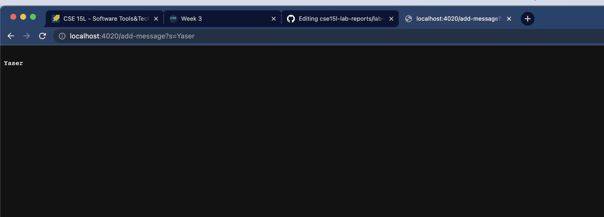

Code for String Server:

```import java.io.IOException;
import java.net.URI;
import java.util.ArrayList;
public class StringHandler implements URLHandler {
    private ArrayList<String> messages = new ArrayList<String>();
    
    public String handleRequest(URI uri) {
        if (uri.getPath().contains("/add-message")) {
            System.out.println(uri.getPath());
            String[] message = uri.getQuery().split("=");
            messages.add(message[1]);
            StringBuilder result = new StringBuilder();
            for (String s : messages) {
                result.append("\n" +s);
            }
            return result.toString();
        }else{
            return "Invalid request";
        }
    }
}


class StringServer {
    public static void main(String[] args) throws IOException {
        if(args.length == 0){
            System.out.println("Missing port number! Try any number between 1024 to 49151");
            return;
        }

        int port = Integer.parseInt(args[0]);

        Server.start(port, new StringHandler());
    }
}
```



